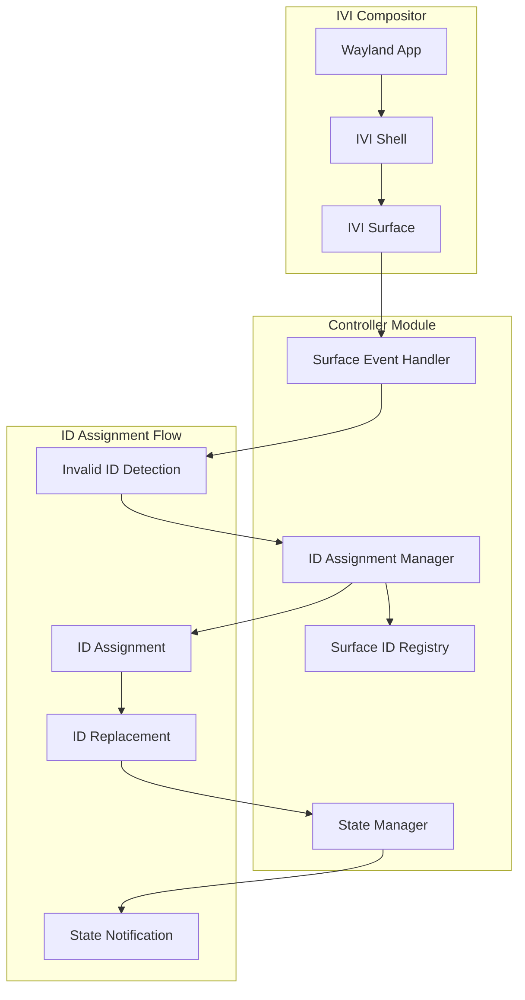
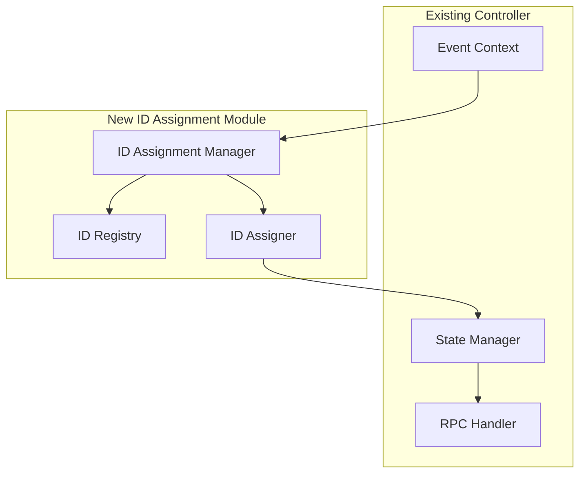

# Design Document: Automatic Surface ID Assignment

## Overview

The Automatic Surface ID Assignment feature extends the existing Weston IVI Controller to detect and handle surfaces created with invalid IDs (`0xFFFFFFFF`). When the IVI shell compositor assigns this invalid ID to surfaces that don't specify an ID, the controller will automatically assign a valid, unique ID from a dedicated range (`0x10000000` to `0xFFFFFFFE`). This ensures all surfaces can be properly managed through the existing IVI control operations.

The feature integrates seamlessly with the existing controller architecture, adding ID management capabilities to the surface lifecycle event handling system. It maintains thread safety, provides comprehensive logging, and supports ID reuse to prevent exhaustion of the ID space.

## Architecture

### High-Level Architecture



### Integration with Existing Architecture

The auto surface ID assignment integrates with the existing controller architecture at the event handling layer:



## Components and Interfaces

### 1. ID Assignment Manager

**Purpose**: Central coordinator for automatic surface ID assignment operations.

**Key Types**:
```rust
pub struct IdAssignmentManager {
    registry: Arc<Mutex<SurfaceIdRegistry>>,
    assigner: Arc<Mutex<IdAssigner>>,
    ivi_api: Arc<IviLayoutApi>,
}

pub struct IdAssignmentConfig {
    pub start_id: u32,           // 0x10000000
    pub max_id: u32,             // 0xFFFFFFFE
    pub invalid_id: u32,         // 0xFFFFFFFF
}
```

**Operations**:
- Detect invalid surface IDs during surface creation events
- Coordinate ID assignment process
- Handle surface destruction and ID release
- Provide thread-safe access to ID operations

### 2. Surface ID Registry

**Purpose**: Track active surface IDs and manage ID availability for conflict detection and reuse.

**Key Types**:
```rust
pub struct SurfaceIdRegistry {
    active_ids: HashSet<u32>,
    auto_assigned_ids: HashSet<u32>,
    config: IdAssignmentConfig,
}

pub struct RegistryStats {
    pub total_active: usize,
    pub auto_assigned_count: usize,
    pub available_count: usize,
}
```

**Operations**:
- Register new surface IDs (both manual and auto-assigned)
- Release IDs when surfaces are destroyed
- Check ID availability for conflict detection
- Provide statistics for monitoring and debugging

### 3. ID Assigner

**Purpose**: Implement the ID assignment algorithm with wraparound and conflict resolution.

**Key Types**:
```rust
pub struct IdAssigner {
    current_id: u32,
    config: IdAssignmentConfig,
}

pub struct AssignmentResult {
    pub assigned_id: u32,
    pub wrapped_around: bool,
    pub conflicts_resolved: u32,
}

pub enum AssignmentError {
    NoAvailableIds,
    InvalidConfiguration,
    RegistryError(String),
}
```

**Operations**:
- Generate next available ID with sequential assignment
- Handle wraparound when reaching maximum ID
- Resolve conflicts by searching for available IDs
- Return detailed assignment results for logging

### 4. Surface Event Integration

**Purpose**: Integrate ID assignment into existing surface lifecycle event handling.

**Enhanced Event Handler**:
```rust
impl EventContext {
    /// Enhanced surface creation handler with ID assignment
    pub fn handle_surface_created_with_id_assignment(
        &self, 
        surface_id: u32
    ) -> Result<u32, IdAssignmentError> {
        // Detect invalid ID and trigger assignment if needed
        // Integrate with existing surface creation flow
    }
    
    /// Enhanced surface destruction handler with ID release
    pub fn handle_surface_destroyed_with_id_release(
        &self, 
        surface_id: u32
    ) {
        // Release ID if it was auto-assigned
        // Call existing destruction handler
    }
}
```

## Data Models

### ID Assignment Data Structures

```rust
/// Configuration for ID assignment behavior
pub struct IdAssignmentConfig {
    pub start_id: u32,           // 0x10000000 (268435456)
    pub max_id: u32,             // 0xFFFFFFFE (4294967294)
    pub invalid_id: u32,         // 0xFFFFFFFF (4294967295)
}

impl Default for IdAssignmentConfig {
    fn default() -> Self {
        Self {
            start_id: 0x10000000,
            max_id: 0xFFFFFFFE,
            invalid_id: 0xFFFFFFFF,
        }
    }
}

/// Registry entry for tracking surface ID information
#[derive(Debug, Clone)]
pub struct SurfaceIdInfo {
    pub id: u32,
    pub is_auto_assigned: bool,
    pub assigned_at: std::time::Instant,
    pub original_id: Option<u32>,  // Store original invalid ID for logging
}

/// Result of ID assignment operation
#[derive(Debug)]
pub struct IdAssignmentResult {
    pub old_id: u32,
    pub new_id: u32,
    pub wrapped_around: bool,
    pub conflicts_resolved: u32,
    pub assignment_time: std::time::Duration,
}

/// Statistics for monitoring ID assignment system
#[derive(Debug, Clone)]
pub struct IdAssignmentStats {
    pub total_assignments: u64,
    pub wraparounds: u64,
    pub conflicts_resolved: u64,
    pub active_auto_assigned: usize,
    pub available_ids: usize,
    pub registry_size: usize,
}
```

### Error Types

```rust
#[derive(Debug, thiserror::Error)]
pub enum IdAssignmentError {
    #[error("No available IDs in auto-assignment range")]
    NoAvailableIds,
    
    #[error("Invalid configuration: {reason}")]
    InvalidConfiguration { reason: String },
    
    #[error("Registry operation failed: {message}")]
    RegistryError { message: String },
    
    #[error("IVI API operation failed: {operation}")]
    IviApiError { operation: String },
    
    #[error("Surface not found: {id}")]
    SurfaceNotFound { id: u32 },
    
    #[error("Thread synchronization error: {message}")]
    SyncError { message: String },
}
```

## Correctness Properties

*A property is a characteristic or behavior that should hold true across all valid executions of a system-essentially, a formal statement about what the system should do. Properties serve as the bridge between human-readable specifications and machine-verifiable correctness guarantees.*

### Property 1: Invalid ID detection accuracy
*For any* surface creation event with ID `0xFFFFFFFF`, the Controller Module should detect it as an invalid surface ID and trigger automatic assignment
**Validates: Requirements 1.1, 1.2**

### Property 2: Valid ID preservation
*For any* surface creation event with a valid ID (not `0xFFFFFFFF`), the Controller Module should not trigger automatic assignment
**Validates: Requirements 1.4**

### Property 3: Comprehensive monitoring
*For any* surface creation event, the Controller Module should monitor it for invalid ID detection
**Validates: Requirements 1.3**

### Property 4: Sequential ID assignment
*For any* sequence of surfaces requiring automatic assignment, the assigned IDs should start from `0x10000000` and increment by 1 for each assignment
**Validates: Requirements 2.1, 2.2**

### Property 5: Assignment range compliance
*For any* automatically assigned surface ID, it should be within the range `0x10000000` to `0xFFFFFFFE`
**Validates: Requirements 2.3**

### Property 6: Invalid ID avoidance
*For any* ID assignment operation, the assigned ID should never be `0xFFFFFFFF`
**Validates: Requirements 2.4**

### Property 7: Wraparound behavior
*For any* ID assignment that reaches `0xFFFFFFFE`, the next assignment should wrap around to `0x10000000`
**Validates: Requirements 2.5**

### Property 8: Conflict detection during wraparound
*For any* wraparound scenario where `0x10000000` is already in use, the system should detect the conflict and search for the next available ID
**Validates: Requirements 3.1, 3.2**

### Property 9: Persistent conflict resolution
*For any* ID assignment with conflicts, the system should continue searching until an available ID is found or all IDs are exhausted
**Validates: Requirements 3.3**

### Property 10: Registry accuracy
*For any* active surface, its ID should be present in the Surface Registry
**Validates: Requirements 3.4**

### Property 11: ID reuse after destruction
*For any* surface with an auto-assigned ID that is destroyed, that ID should become available for reuse in future assignments
**Validates: Requirements 4.1, 4.2**

### Property 12: Reuse during wraparound
*For any* wraparound scenario with previously freed IDs available, those IDs should be reusable for new assignments
**Validates: Requirements 4.3**

### Property 13: Sequential assignment priority
*For any* ID assignment scenario with both sequential and reusable IDs available, sequential assignment should be preferred
**Validates: Requirements 4.4**

### Property 14: Surface accessibility after assignment
*For any* surface that receives an auto-assigned ID, it should be accessible using that new ID through standard IVI operations
**Validates: Requirements 5.2, 5.3**

### Property 15: ID replacement verification
*For any* ID replacement operation, the system should verify success before proceeding with surface management
**Validates: Requirements 5.4**

### Property 16: ID persistence during lifetime
*For any* surface with an auto-assigned ID, that ID should remain constant until the surface is destroyed
**Validates: Requirements 6.1, 6.2**

### Property 17: Query consistency
*For any* surface with an auto-assigned ID, querying its information should consistently return the same ID value
**Validates: Requirements 6.3**

### Property 18: Notification inclusion
*For any* surface state notification involving a surface with an auto-assigned ID, the notification should include the auto-assigned ID
**Validates: Requirements 6.4**

### Property 19: Operational equivalence
*For any* IVI operation, surfaces with auto-assigned IDs should behave identically to surfaces with manually specified IDs
**Validates: Requirements 6.5**

### Property 20: Comprehensive logging
*For any* ID assignment operation (detection, assignment, wraparound, release, error), appropriate log entries should be created with relevant details
**Validates: Requirements 7.1, 7.2, 7.3, 7.4, 7.5**

### Property 21: Concurrent assignment uniqueness
*For any* set of concurrent surface creation events requiring ID assignment, each surface should receive a unique ID
**Validates: Requirements 8.2, 8.5**

### Property 22: Thread-safe operations
*For any* concurrent ID assignment operations, the system should maintain atomicity and prevent race conditions
**Validates: Requirements 8.1, 8.3**

### Property 23: Registry consistency under concurrency
*For any* concurrent operations on the Surface Registry, the registry should maintain consistency and accuracy
**Validates: Requirements 8.4**

## Error Handling

### Error Categories

1. **ID Exhaustion**: When all IDs in the auto-assignment range are in use
2. **IVI API Failures**: When surface ID replacement operations fail
3. **Registry Corruption**: When the ID registry becomes inconsistent
4. **Concurrency Issues**: When thread synchronization fails
5. **Configuration Errors**: When invalid configuration is provided

### Error Handling Strategy

**ID Exhaustion**:
- Return specific error indicating no available IDs
- Log detailed information about registry state
- Suggest cleanup or configuration changes
- Gracefully handle the surface with original invalid ID

**IVI API Failures**:
- Retry ID replacement operations with exponential backoff
- Log detailed error information including IVI error codes
- Attempt recovery by reverting to original state
- Notify monitoring systems of persistent failures

**Registry Corruption**:
- Detect inconsistencies through validation checks
- Attempt automatic recovery by rebuilding from IVI state
- Log corruption events with detailed diagnostics
- Provide manual recovery mechanisms

**Concurrency Issues**:
- Use appropriate synchronization primitives (Mutex, RwLock)
- Implement timeout mechanisms to prevent deadlocks
- Provide detailed error messages for debugging
- Ensure graceful degradation under high contention

### Error Recovery Mechanisms

```rust
pub enum RecoveryAction {
    Retry { max_attempts: u32, backoff_ms: u64 },
    Fallback { alternative_strategy: String },
    Abort { cleanup_required: bool },
    Continue { warning_logged: bool },
}

pub struct ErrorRecoveryConfig {
    pub id_replacement_retries: u32,
    pub registry_rebuild_enabled: bool,
    pub fallback_to_invalid_id: bool,
    pub max_concurrent_assignments: usize,
}
```

## Testing Strategy

### Unit Testing

Unit tests will verify individual components of the ID assignment system:

- **ID Assignment Manager**: Test coordination of assignment operations
- **Surface ID Registry**: Test ID tracking, conflict detection, and reuse
- **ID Assigner**: Test assignment algorithm, wraparound, and conflict resolution
- **Event Integration**: Test integration with existing surface lifecycle events

### Property-Based Testing

Property-based tests will verify universal properties using the `proptest` crate:

- **Configuration**: Each property test will run a minimum of 100 iterations
- **Tagging**: Each test will be tagged with format: `// Feature: auto-surface-id, Property {number}: {property_text}`
- **Coverage**: Each correctness property will be implemented by a single property-based test

**Property Test Categories**:

1. **Detection Properties**: Test invalid ID detection accuracy (Properties 1, 2, 3)
2. **Assignment Properties**: Test ID assignment behavior (Properties 4, 5, 6, 7)
3. **Conflict Resolution Properties**: Test wraparound and conflict handling (Properties 8, 9, 12, 13)
4. **Registry Properties**: Test registry accuracy and consistency (Properties 10, 23)
5. **Lifecycle Properties**: Test ID reuse and persistence (Properties 11, 16, 17)
6. **Integration Properties**: Test surface accessibility and operations (Properties 14, 15, 18, 19)
7. **Concurrency Properties**: Test thread safety and uniqueness (Properties 21, 22)
8. **Logging Properties**: Test comprehensive logging (Property 20)

### Integration Testing

Integration tests will verify end-to-end functionality:

- Surface creation with invalid IDs in test Weston environment
- ID assignment and replacement through full IVI stack
- Concurrent surface creation scenarios
- Registry persistence across controller restarts
- Error handling and recovery mechanisms

### Test Utilities

**Surface Generators**: Generate random surface creation events with various ID values
**Concurrency Test Harness**: Create controlled concurrent scenarios
**Mock IVI API**: Simulate IVI API failures for error testing
**Registry Validators**: Verify registry consistency and accuracy

## Implementation Notes

### Dependencies

**New Dependencies**:
- No additional external dependencies required
- Leverages existing `std::collections::HashSet` for registry
- Uses existing `Arc<Mutex<>>` pattern for thread safety
- Integrates with existing `jlogger-tracing` for logging

### Integration Points

**Event System Integration**:
```rust
// Enhanced surface creation callback
unsafe extern "C" fn surface_created_callback_with_id_assignment(
    listener: *mut wl_listener, 
    data: *mut c_void
) {
    // Existing surface creation logic
    // + ID assignment detection and handling
}
```

**State Manager Integration**:
```rust
impl StateManager {
    /// Enhanced surface creation handler
    pub fn handle_surface_created_with_id_assignment(
        &mut self, 
        surface_id: u32
    ) -> Result<u32, IdAssignmentError> {
        // Check for invalid ID and assign if needed
        // Call existing handle_surface_created
    }
}
```

### Configuration

The ID assignment system will be configurable through the existing plugin configuration mechanism:

```rust
pub struct AutoIdConfig {
    pub enabled: bool,
    pub start_id: u32,
    pub max_id: u32,
    pub log_assignments: bool,
    pub max_concurrent_assignments: usize,
}
```

### Performance Considerations

- **Registry Operations**: Use `HashSet` for O(1) ID lookups
- **Assignment Algorithm**: Optimize for sequential assignment (common case)
- **Concurrency**: Minimize lock contention with fine-grained locking
- **Memory Usage**: Efficient storage of active ID set
- **Logging**: Configurable log levels to control overhead

### Monitoring and Observability

**Metrics**:
- Total assignments performed
- Wraparound events
- Conflicts resolved
- Assignment latency
- Registry size and utilization

**Health Checks**:
- Registry consistency validation
- ID space utilization monitoring
- Error rate tracking
- Performance degradation detection