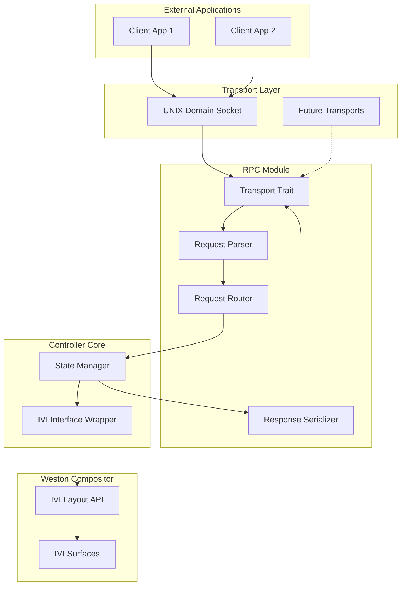

# Design Document: Weston IVI Controller

## Overview

The Weston IVI Controller is a Rust-based shared library plugin for the Weston compositor that provides programmatic control over IVI (In-Vehicle Infotainment) surfaces through an RPC interface. The system consists of three main architectural layers:

1. **FFI Layer**: C-compatible interface for Weston plugin integration
2. **Core Controller Layer**: Rust implementation managing IVI surfaces and state
3. **RPC Layer**: Modular RPC system with pluggable transport mechanisms

The design emphasizes modularity, type safety, and extensibility while maintaining compatibility with Weston's C-based plugin architecture.

## Architecture

### High-Level Architecture



### Module Structure

```
weston-ivi-controller/
├── src/
│   ├── lib.rs              # Plugin entry point and FFI exports
│   ├── ffi/
│   │   ├── mod.rs          # FFI module
│   │   └── bindings.rs     # Weston/IVI C bindings
│   ├── controller/
│   │   ├── mod.rs          # Controller module
│   │   ├── state.rs        # State management
│   │   └── ivi_wrapper.rs  # Safe IVI API wrapper
│   ├── rpc/
│   │   ├── mod.rs          # RPC module
│   │   ├── protocol.rs     # RPC protocol definitions
│   │   ├── handler.rs      # Request handler
│   │   └── transport.rs    # Transport trait
│   └── transport/
│       ├── mod.rs          # Transport implementations
│       └── unix_socket.rs  # UNIX domain socket transport
```

## Components and Interfaces

### 1. FFI Layer

**Purpose**: Provide C-compatible interface for Weston plugin loading and lifecycle management.

**Key Components**:

- `wet_module_init()`: Entry point called by Weston when loading the plugin
- `wet_module_destroy()`: Cleanup function called when unloading
- `get_ivi_layout_api()`: Retrieves the IVI layout API from Weston compositor
- Weston callback handlers for surface lifecycle events

**Interface**:
```rust
#[no_mangle]
pub extern "C" fn wet_module_init(
    compositor: *mut weston_compositor,
    argc: c_int,
    argv: *const *const c_char
) -> c_int;

#[no_mangle]
pub extern "C" fn wet_module_destroy(plugin_data: *mut c_void);

unsafe fn get_ivi_layout_api(
    compositor: *mut weston_compositor
) -> *const ivi_layout_interface;
```

**IVI Layout API Retrieval**:

The IVI layout API is retrieved from the Weston compositor using the plugin API mechanism. The process involves:

1. **API Name Definition**: Define the IVI layout API name constant (`IVI_LAYOUT_API_NAME = "ivi_layout_api_v1"`)
2. **API Retrieval**: Call `weston_plugin_api_get()` with the compositor pointer, API name, and interface size
3. **Validation**: Verify the returned pointer is non-null before use
4. **Error Handling**: Return initialization error if API is unavailable

The IVI layout API must be retrieved during plugin initialization before any IVI operations can be performed. If the API is not available (e.g., IVI shell not loaded), the plugin initialization must fail gracefully.

### 2. IVI Interface Wrapper

**Purpose**: Provide safe Rust abstractions over the C-based IVI layout API.

**Key Types**:
```rust
pub struct IviLayoutApi {
    api: *const ivi_layout_interface,
}

pub struct IviSurface {
    handle: *mut ivi_layout_surface,
    api: Arc<IviLayoutApi>,
}

pub struct IviLayer {
    handle: *mut ivi_layout_layer,
    api: Arc<IviLayoutApi>,
}
```

**Operations**:
- Surface property queries and modifications
- Layer management
- Commit operations
- Event listener registration

### 3. State Manager

**Purpose**: Maintain internal representation of IVI surfaces and their properties.

**Key Types**:
```rust
pub struct SurfaceState {
    pub id: u32,
    pub position: (i32, i32),
    pub size: (i32, i32),
    pub visibility: bool,
    pub opacity: f32,
    pub orientation: Orientation,
    pub z_order: i32,
}

pub struct StateManager {
    surfaces: HashMap<u32, SurfaceState>,
    ivi_api: Arc<IviLayoutApi>,
}
```

**Responsibilities**:
- Track all active IVI surfaces
- Handle surface lifecycle events (create, destroy, configure)
- Synchronize state with IVI layout API
- Provide query interface for RPC handlers

### 4. RPC Protocol

**Purpose**: Define message format for client-server communication.

**Protocol Format**: JSON-based request/response protocol

**Request Structure**:
```rust
pub struct RpcRequest {
    pub id: u64,
    pub method: String,
    pub params: serde_json::Value,
}
```

**Response Structure**:
```rust
pub struct RpcResponse {
    pub id: u64,
    pub result: Option<serde_json::Value>,
    pub error: Option<RpcError>,
}
```

**Supported Methods**:
- `list_surfaces`: Get all active surfaces
- `get_surface`: Get specific surface properties
- `set_position`: Update surface position
- `set_size`: Update surface size
- `set_visibility`: Show/hide surface
- `set_opacity`: Adjust surface opacity
- `set_orientation`: Rotate surface
- `set_z_order`: Change stacking order
- `set_focus`: Route input focus

### 5. Transport Abstraction

**Purpose**: Decouple RPC logic from communication mechanism.

**Transport Trait**:
```rust
pub trait Transport: Send + Sync {
    fn start(&mut self) -> Result<(), TransportError>;
    fn stop(&mut self) -> Result<(), TransportError>;
    fn send(&self, client_id: ClientId, data: &[u8]) -> Result<(), TransportError>;
    fn register_handler(&mut self, handler: Box<dyn MessageHandler>);
}

pub trait MessageHandler: Send + Sync {
    fn handle_message(&self, client_id: ClientId, data: &[u8]);
    fn handle_disconnect(&self, client_id: ClientId);
}
```

### 6. UNIX Domain Socket Transport

**Purpose**: Implement Transport trait using UNIX domain sockets.

**Key Features**:
- Non-blocking I/O using mio or tokio
- Multiple concurrent client connections
- Automatic client cleanup on disconnect
- Configurable socket path

**Configuration**:
```rust
pub struct UnixSocketConfig {
    pub socket_path: PathBuf,
    pub max_connections: usize,
}
```

## Data Models

### Surface Properties

```rust
pub struct SurfaceProperties {
    pub id: u32,
    pub position: Position,
    pub size: Size,
    pub source_rect: Rectangle,
    pub dest_rect: Rectangle,
    pub visibility: bool,
    pub opacity: f32,
    pub orientation: Orientation,
    pub z_order: i32,
}

pub struct Position {
    pub x: i32,
    pub y: i32,
}

pub struct Size {
    pub width: i32,
    pub height: i32,
}

pub struct Rectangle {
    pub x: i32,
    pub y: i32,
    pub width: i32,
    pub height: i32,
}

pub enum Orientation {
    Normal,        // 0 degrees
    Rotate90,      // 90 degrees
    Rotate180,     // 180 degrees
    Rotate270,     // 270 degrees
}
```

### RPC Messages

```rust
pub enum RpcMethod {
    ListSurfaces,
    GetSurface { id: u32 },
    SetPosition { id: u32, x: i32, y: i32 },
    SetSize { id: u32, width: i32, height: i32 },
    SetVisibility { id: u32, visible: bool },
    SetOpacity { id: u32, opacity: f32 },
    SetOrientation { id: u32, orientation: Orientation },
    SetZOrder { id: u32, z_order: i32 },
    SetFocus { id: u32 },
}

pub struct RpcError {
    pub code: i32,
    pub message: String,
}
```

## C
orrectness Properties

*A property is a characteristic or behavior that should hold true across all valid executions of a system-essentially, a formal statement about what the system should do. Properties serve as the bridge between human-readable specifications and machine-verifiable correctness guarantees.*

### Property 1: Position update correctness
*For any* IVI Surface and any valid position coordinates within display bounds, setting the position should result in the surface having exactly those coordinates
**Validates: Requirements 2.1**

### Property 2: Size update correctness
*For any* IVI Surface and any valid size dimensions (positive non-zero), setting the size should result in the surface having exactly those dimensions
**Validates: Requirements 2.2**

### Property 3: Position bounds validation
*For any* position coordinates outside valid display bounds, the Controller Module should reject the position change request
**Validates: Requirements 2.3**

### Property 4: Size validation
*For any* size dimensions that are zero or negative, the Controller Module should reject the size change request
**Validates: Requirements 2.4**

### Property 5: Geometry change notification
*For any* IVI Surface, when position or size is updated, a geometry change notification should be sent to the Wayland Client
**Validates: Requirements 2.5**

### Property 6: Show surface correctness
*For any* IVI Surface, requesting to show the surface should result in the surface visibility being true
**Validates: Requirements 3.1**

### Property 7: Hide surface correctness
*For any* IVI Surface, requesting to hide the surface should result in the surface visibility being false
**Validates: Requirements 3.2**

### Property 8: Visibility independence
*For any* two distinct IVI Surfaces, changing the visibility of one surface should not affect the visibility of the other surface
**Validates: Requirements 3.4**

### Property 9: Z-order update correctness
*For any* IVI Surface and any valid z-order value, setting the z-order should result in the surface having exactly that z-order value
**Validates: Requirements 4.1**

### Property 10: Z-order consistency
*For any* set of IVI Surfaces in the same layer, the z-order values should form a consistent ordering with no duplicates
**Validates: Requirements 4.2**

### Property 11: Z-order validation
*For any* z-order value outside the valid range for a layer, the Controller Module should reject the z-order change request
**Validates: Requirements 4.4**

### Property 12: Orientation update correctness
*For any* IVI Surface and any valid orientation (0, 90, 180, 270 degrees), setting the orientation should result in the surface having exactly that orientation
**Validates: Requirements 5.1**

### Property 13: Orientation validation
*For any* orientation value that is not a multiple of 90 degrees, the Controller Module should reject the orientation change request
**Validates: Requirements 5.4**

### Property 14: Opacity update correctness
*For any* IVI Surface and any valid opacity value in the range [0.0, 1.0], setting the opacity should result in the surface having exactly that opacity value
**Validates: Requirements 6.1**

### Property 15: Opacity validation
*For any* opacity value outside the range [0.0, 1.0], the Controller Module should reject the opacity change request
**Validates: Requirements 6.3**

### Property 16: Keyboard focus correctness
*For any* IVI Surface, requesting input focus should result in that surface having keyboard focus
**Validates: Requirements 7.1**

### Property 17: Pointer focus correctness
*For any* IVI Surface, requesting input focus should result in that surface having pointer focus
**Validates: Requirements 7.2**

### Property 18: Focus exclusivity
*For any* two IVI Surfaces, when focus is set to the second surface, the first surface should lose focus
**Validates: Requirements 7.3**

### Property 19: Focus change notification
*For any* focus change between two surfaces, both the old and new focused surfaces should receive focus change notifications
**Validates: Requirements 7.4**

### Property 20: Surface creation tracking
*For any* IVI Surface creation event, the Controller Module should record the surface information in its internal state
**Validates: Requirements 8.1**

### Property 21: Surface destruction tracking
*For any* IVI Surface destruction event, the Controller Module should remove the surface information from its internal state
**Validates: Requirements 8.2**

### Property 22: State synchronization
*For any* IVI Surface state change, the internal state representation should be updated to match the actual surface state
**Validates: Requirements 8.3**

### Property 23: State query availability
*For any* active IVI Surface, its state information should be retrievable via the RPC interface
**Validates: Requirements 8.4**

### Property 24: State accuracy
*For any* set of active IVI Surfaces, the internal state should accurately reflect the actual state of all surfaces
**Validates: Requirements 8.5**

### Property 25: RPC request round-trip
*For any* valid RPC request, serializing then parsing should produce an equivalent request
**Validates: Requirements 9.2**

### Property 26: RPC response round-trip
*For any* RPC response, serializing then parsing should produce an equivalent response
**Validates: Requirements 9.3**

### Property 27: RPC validation independence
*For any* invalid RPC request, the validation and error response should be independent of the transport mechanism used
**Validates: Requirements 9.5**

### Property 28: Transport independence
*For any* transport implementation, all RPC operations should function correctly
**Validates: Requirements 10.4**

### Property 29: Connection acceptance
*For any* client connection attempt to the UNIX domain socket, the transport should accept the connection
**Validates: Requirements 11.3**

### Property 30: Concurrent connection handling
*For any* set of concurrent client connections, the UNIX domain socket transport should handle all connections independently
**Validates: Requirements 11.4**

### Property 31: Connection cleanup
*For any* client connection that is lost, the transport should clean up all associated resources
**Validates: Requirements 11.5**

### Property 32: Surface list completeness
*For any* set of active IVI Surfaces, the RPC list_surfaces operation should return information about all surfaces
**Validates: Requirements 12.1**

### Property 33: Property retrieval completeness
*For any* active IVI Surface, the RPC get_surface operation should return all properties (position, size, visibility, z-order, orientation, opacity)
**Validates: Requirements 12.2**

### Property 34: Surface info serialization round-trip
*For any* surface information, serializing then deserializing should produce equivalent information
**Validates: Requirements 12.3**

### Property 35: Non-existent surface error handling
*For any* non-existent surface ID, querying surface information should return an error response
**Validates: Requirements 12.4**

### Property 36: Invalid request error handling
*For any* RPC request with invalid data, the RPC Module should return an error response with a descriptive message
**Validates: Requirements 13.1**

### Property 37: IVI error propagation
*For any* RPC operation that fails due to IVI interface errors, the RPC Module should return an error response indicating the failure reason
**Validates: Requirements 13.2**

### Property 38: Client isolation
*For any* client connection that is lost, other active client connections should continue to be served without interruption
**Validates: Requirements 13.3**

### Property 39: Error logging
*For any* error condition, the Controller Module should log the error with sufficient detail for debugging
**Validates: Requirements 13.4**

## Error Handling

### Error Categories

1. **Validation Errors**: Invalid input parameters (out of bounds, wrong type, etc.)
2. **IVI Interface Errors**: Failures from the underlying IVI layout API
3. **Transport Errors**: Connection failures, socket errors, serialization errors
4. **State Errors**: Inconsistent state, missing surfaces, etc.

### Error Handling Strategy

**Validation Errors**:
- Validate all inputs before calling IVI API
- Return descriptive error messages to clients
- Log validation failures for debugging

**IVI Interface Errors**:
- Wrap all IVI API calls with error checking
- Convert IVI error codes to descriptive error messages
- Propagate errors to RPC clients with context

**Transport Errors**:
- Handle connection failures gracefully
- Clean up resources on disconnect
- Continue serving other clients on individual client failures

**State Errors**:
- Maintain consistency through careful state management
- Recover from inconsistencies when possible
- Log state errors for debugging

### Error Types

```rust
pub enum ControllerError {
    InvalidParameter { param: String, reason: String },
    OutOfBounds { param: String, value: String, bounds: String },
    SurfaceNotFound { id: u32 },
    IviApiError { operation: String, code: i32 },
    TransportError { message: String },
    SerializationError { message: String },
    StateError { message: String },
}
```

## Testing Strategy

### Unit Testing

Unit tests will verify specific functionality of individual components:

- **FFI Layer**: Test plugin initialization and cleanup
- **IVI Wrapper**: Test safe wrapper functions around IVI API
- **State Manager**: Test state tracking and synchronization
- **RPC Protocol**: Test request/response parsing and serialization
- **Transport**: Test connection handling and message passing

### Property-Based Testing

Property-based tests will verify universal properties across all inputs using the `proptest` crate for Rust:

- **Configuration**: Each property test will run a minimum of 100 iterations
- **Tagging**: Each property-based test will be tagged with a comment explicitly referencing the correctness property from this design document
- **Format**: Tags will use the format: `// Feature: weston-ivi-controller, Property {number}: {property_text}`
- **Coverage**: Each correctness property listed above will be implemented by a single property-based test

**Property Test Categories**:

1. **Input Validation Properties**: Test that invalid inputs are rejected (Properties 3, 4, 11, 13, 15, 35, 36)
2. **State Update Properties**: Test that operations correctly update state (Properties 1, 2, 6, 7, 9, 12, 14, 16, 17)
3. **State Consistency Properties**: Test that state remains consistent (Properties 8, 10, 22, 24, 32, 33)
4. **Round-Trip Properties**: Test serialization/deserialization (Properties 25, 26, 34)
5. **Notification Properties**: Test that events trigger notifications (Properties 5, 19, 39)
6. **Lifecycle Properties**: Test creation and cleanup (Properties 20, 21, 31, 38)
7. **Transport Independence Properties**: Test behavior across transports (Properties 27, 28, 29, 30)

### Integration Testing

Integration tests will verify end-to-end functionality:

- Plugin loading and initialization in a test Weston environment
- RPC client communication over UNIX domain socket
- Surface control operations through the full stack
- Multiple concurrent client scenarios

### Test Utilities

**Mock IVI API**: For unit testing without Weston
**Test RPC Client**: For integration testing
**Surface Generators**: For property-based testing (generate random valid/invalid surface properties)

## Implementation Notes

### Dependencies

**Runtime Dependencies**:
- **libc**: C FFI bindings
- **serde**: Serialization framework
- **serde_json**: JSON protocol implementation
- **proptest**: Property-based testing
- **mio** or **tokio**: Async I/O for transport layer
- **jlogger-tracing**: Logging framework with tracing support
- **thiserror**: Error handling

**Build Dependencies**:
- **bindgen**: Automatic generation of Rust FFI bindings from C headers

### Build Configuration

The module must be built as a `cdylib` (C dynamic library) to be loadable by Weston:

```toml
[lib]
crate-type = ["cdylib"]

[build-dependencies]
bindgen = "0.69"
```

### Build Script

A `build.rs` script will use `bindgen` to generate Rust bindings from the IVI layout header:

```rust
// build.rs
use std::env;
use std::path::PathBuf;

fn main() {
    println!("cargo:rerun-if-changed=ivi-shell/ivi-layout-export.h");
    
    let bindings = bindgen::Builder::default()
        .header("ivi-shell/ivi-layout-export.h")
        .parse_callbacks(Box::new(bindgen::CargoCallbacks))
        .allowlist_type("ivi_layout_.*")
        .allowlist_function("ivi_layout_.*")
        .allowlist_var("IVI_.*")
        .generate()
        .expect("Unable to generate bindings");
    
    let out_path = PathBuf::from(env::var("OUT_DIR").unwrap());
    bindings
        .write_to_file(out_path.join("ivi_bindings.rs"))
        .expect("Couldn't write bindings!");
}
```

The generated bindings will be included in the FFI module:

```rust
// src/ffi/bindings.rs
#![allow(non_upper_case_globals)]
#![allow(non_camel_case_types)]
#![allow(non_snake_case)]
#![allow(dead_code)]

include!(concat!(env!("OUT_DIR"), "/ivi_bindings.rs"));
```

### Safety Considerations

- All FFI boundaries must be carefully validated
- Raw pointers from C must be checked for null
- Lifetimes of C objects must be respected
- Panic unwinding across FFI boundary must be prevented using `catch_unwind`

### Performance Considerations

- Minimize allocations in hot paths
- Use efficient data structures (HashMap for surface lookup)
- Batch IVI API calls when possible
- Use non-blocking I/O for transport layer

### Extensibility

The design supports future extensions:

- Additional transport mechanisms (TCP, shared memory, etc.)
- Additional RPC methods for new IVI features
- Plugin configuration via command-line arguments or config file
- Multiple RPC protocol formats (MessagePack, Protocol Buffers, etc.)
